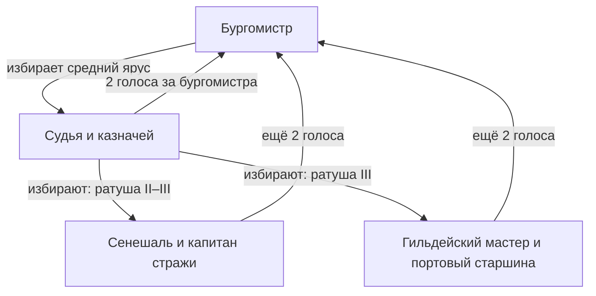
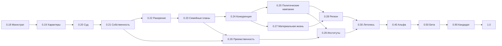

# Данциг: дорожная карта 0.17.1 → 1.0

Дата: 1 октября 2026 года. План одобрен пользователем до 0.30.0 включительно. В 0.30 требуется полный пересмотр статистики, графиков, вкладок жителей и подборки связанных интересных событий. Статус выполнения отмечается в CHECKPOINT.md; описание ниже задаёт условия каждого этапа. Исходная версия — 0.17.1, коммит `b305ef7`.

Уточнение от 1 октября: после 0.19.0 пользователь разрешил совместно разработать 0.20 и 0.21, проверить их вместе и остановиться. Оба этапа завершены; к 0.22.0 не переходить без нового запроса.

## Цель версии 1.0

Автономный город, в котором жители и семьи зарабатывают, владеют имуществом, конкурируют, ищут союзников, занимают государственные должности и несут последствия решений. Пользователь наблюдает, выбирает людей и вмешивается через события и городские указы. Самостоятельное управление остаётся основным режимом.

Ключевой результат: город создаёт объяснимые истории. Нехватка сырья ведёт к убыткам, убытки — к конфликтам с кредитором, конфликт — к судебному делу, решение суда — к смене собственности и политических союзов. У каждого звена есть участники, время, основания и реальные последствия.

Для первого релиза сохраняем браузерную схематическую карту. Технический переход к отдельному движку оцениваем по измерениям производительности и требованиям визуализации. Локальный игровой ИИ обеспечивает все обязательные механики плана.

## Что уже работает

Потребности, девять непрерывных черт характера, память, намерения, обучение и передача привычек; семьи, бюджет, рынок труда, договоры и личные займы; производство нескольких видов товаров, фактические продажи и расходы предприятий; строительство за материалы и труд; семейные гильдии; бюджет, налоги, региональные сборы; должности; преступления и расследования; сословия, титулы, типы жилья, теснота и переселение; графики и итоговый отчёт.

Основные пробелы: полноценное голосование, индивидуальное судопроизводство, рынок собственности, процедура разорения, глубокая конкуренция, имущественная преемственность и связь кратких действий с длительными семейными проектами.

## Городская хартия: должности и выборщики

### Требования пользователя

- Ратуша открывает последовательно 3, 5 и 7 политических должностей, включая бургомистра.
- Нижний ярус избирается должностными лицами непосредственно вышестоящего яруса.
- Бургомистра избирают все действующие должностные лица ниже него.
- Каждую должность занимает конкретный человек; судебное решение принимает конкретный судья.
- Полномочия используются самостоятельно, с учётом характера, отношений, доступной информации и состояния города.

Далее приведена предлагаемая игровая хартия. Названия, продолжительность сроков и числовые условия — проектные решения для обсуждения и балансировки.

### Состав ратуши

| Ратуша | Верхний ярус | Средний ярус | Нижний ярус | Выборщики бургомистра |
|---|---|---|---|---|
| I: 3 должности | Бургомистр | — | Судья, казначей | Судья и казначей: 2 голоса |
| II: 5 должностей | Бургомистр | Судья, казначей | Сенешаль, капитан стражи | Все четыре нижестоящих: 4 голоса |
| III: 7 должностей | Бургомистр | Судья, казначей | Сенешаль, капитан стражи, гильдейский мастер, портовый старшина | Все шесть нижестоящих: 6 голосов |

На I уровне бургомистр лично голосует по назначению судьи и казначея: это один выборщик, бюллетень и мотив сохраняются. На II–III уровнях бургомистр избирает средний ярус, а судья и казначей совместно избирают каждую должность нижнего яруса. Смена уровня меняет состав выборщиков только для новых выборов; незавершённые выборы сохраняют исходный состав.

При I уровне узел «Судья и казначей» является нижним ярусом; двух других узлов ещё нет.

### Полномочия и работа при неполном составе

| Должность | Основная область | Конкретные решения |
|---|---|---|
| Бургомистр | Общий курс и развитие | Утверждает бюджетные лимиты, резерв и фонд развития; выбирает средний ярус; предлагает изменения хартии и крупные публичные проекты |
| Казначей | Доходы и платёжеспособность | Предлагает ставки, прогнозирует сборы, планирует обязательные платежи и обслуживание долга; выдаёт средства в пределах утверждённых лимитов |
| Судья | Судопроизводство | Назначает заседания, выслушивает стороны, оценивает доказательства, выносит и мотивирует решения; заявляет самоотвод при личной заинтересованности |
| Сенешаль | Земля, стройки и городские работы | Рассматривает разрешения, участки и подрядчиков; определяет административные сборы в пределах хартии |
| Капитан стражи | Безопасность и исполнение | Распределяет дозоры, расследования и исполнение судебных решений; запрашивает финансирование и персонал |
| Гильдейский мастер | Ремёсла и торговые правила | Рассматривает жалобы предприятий, условия ученичества, качество и доступ к ремеслу; предлагает изменения сборов с мастерских |
| Портовый старшина | Внешняя торговля | Регулирует экспортные разрешения и квоты, резерв снабжения, места на перевозку и правила таможни |

Пока профильная должность закрыта уровнем ратуши, административные обязанности распределены явно: стройки, ремёсла и торговля — бургомистру с финансовой проверкой казначея; безопасность и исполнение — городской страже под руководством бургомистра. Судебный вердикт остаётся за судьёй. Исполнение обязанностей не создаёт дополнительного политического места или голоса.

Существующие пороги роста 64 и 96 жителей, цены ратуши 1600 и 6400 талеров используем как исходные значения. Повышение требует материалов, труда, оплаты и сохранения оборотного резерва; падение населения не увольняет весь совет автоматически. Окончательный баланс проверяется длительными сценариями.

### Процедура выборов

1. Предлагаемый полный срок — 24 игровых дня. Регистрация длится 2 дня, встречи с выборщиками — ещё 2 дня, затем заседание и вступление в должность. Это стартовые настройки; предыдущие 12-дневные сроки мигрируют без задних выборов.
2. Кандидат сам выдвигается, оценивая амбиции, обязанности, заработок, поддержку и риск поражения. Базовое требование для 0.18 — возраст от 25 лет, присутствие в городе и возможность выполнять обязанности. Роль квалификации растёт вместе с соответствующими системами; титул не блокирует все стартовые вакансии.
3. Один человек занимает одно политическое место и имеет один голос на соответствующих выборах. Успешный переход на другую должность освобождает прежнюю.
4. Выборщик голосует лично. В записи бюллетеня сохраняются кандидат, доверие, отношение к обещаниям, интересы семьи, известные поступки и основная причина выбора. Результат определяется бюллетенями.
5. Состав выборщиков фиксируется при открытии выборов. Отсутствующий выборщик может не явиться; учитываются кворум и воздержание. После смерти или недееспособности состав повторно утверждается с записью причины. Одна должность не умножает голоса из-за временного исполнения чужих обязанностей.
6. Победителю нужно большинство действительных голосов. При отсутствии большинства — второй тур двух лидеров. При повторном равенстве допускаются переговоры и повторное заседание, затем публичный жребий на сохранённом генераторе случайности. Все этапы воспроизводятся после загрузки.
7. Пока выборы сорваны, действует ограниченный исполняющий обязанности: оплачивает необходимые обязательства и поддерживает службы. Крупные новые проекты и необратимые уступки требуют полноценного полномочия.
8. Смерть, длительная мобилизация, увольнение и переход вверх запускают выборы на конкретное вакантное место. Расписание разных ярусов сдвинуто; одновременно распускать весь совет не требуется.
9. При отсутствии выборщиков сначала восстанавливается вышестоящая должность по аварийной процедуре хартии. В новом городе и при миграции существующий бургомистр становится временным руководителем, формирует первую доступную коллегию; после этого проводится обычное голосование нижестоящих за бургомистра. Основания временных назначений видны в журнале.
10. Подкуп, семейственность, обещания и коалиции возникают из решений участников. Замкнутая схема назначения делает такие коалиции возможными; раскрытие злоупотребления, отзыв полномочий и политическое давление появляются в 0.25.

### Суд как деятельность человека

Дело проходит регистрацию, расследование, подготовку, заседание, решение и исполнение. Судья получает доступные материалы, приглашает стороны и свидетелей, слушает объяснения и выбирает допустимое законом решение. Мир знает произошедшее для проверки модели, но судья может этого не знать. Ненадёжные показания, дружба, страх, принципиальность и личные обязательства влияют на его убеждение и действие.

Решение сохраняет имя судьи, фактические основания, применённое правило, наказание или отказ, срок исполнения. Стража и взыскатели исполняют его отдельными действиями. Нельзя выдать возмещение, если у должника нет соответствующих денег или имущества. Самоотвод, замена судьи и обжалование имеют явную процедуру; при конфликте бургомистра дело не разрешается его личным указом. Региональная инстанция для сложных апелляций добавляется позже.

## Выпуски и критерии готовности

Номер версии обозначает завершённый объём, а не календарный срок. Небольшие исправления выпускаются как 0.x.1/0.x.2; следующий крупный этап начинается после приёмки предыдущего. Сложные этапы можно разделить на подверсии с сохранением их критериев.

### 0.18 — Магистрат и выборщики

**Вводим:** семь определений должностей и составы 3/5/7; ярусы, избирательные коллегии, самовыдвижение, личные бюллетени, сроки, второй тур, вакансии и временное исполнение. Полномочия существующих служб переводятся на новую систему. Судья получает очередь дел и личную обязанность их рассматривать; подробное заседание входит в 0.20.

**В интерфейсе:** схема магистрата с именами, полномочиями и связями «кто избирает кого»; кандидаты, состав коллегии, дата заседания, каждый голос и его мотив. Видны временные назначения и пропуски заседаний.

**Приёмка:** на трёх уровнях ровно 3/5/7 политических мест; в выборах бургомистра ровно 2/4/6 возможных голосов; нижний ярус избирает только положенная коллегия; один человек не получает несколько голосов. Смерть, мобилизация, равенство и нехватка кандидатов имеют завершённые процедуры. Загрузка в середине выборов повторяет тот же результат. Старые указы, деньги и должностная история сохраняются.

**Зависимости:** работающие отношения, бюджет и локальный ИИ 0.17.1.

### 0.19 — Характер, биография и имена

**Вводим:** ценности честности, справедливости и семейной лояльности; устойчивые склонности и временное состояние — страх, обида, горе, уверенность, стресс. Биографические события изменяют поведение постепенно. Различаем отношение к закону, к семье и к собственному статусу. Добавляем составные имена, расширенный набор фамилий, семейные традиции именования и прозвища, заработанные поступками.

**В интерфейсе:** короткий портрет личности, текущие переживания, события, повлиявшие на мнение, понятные причины разного поведения. Предлагаемый объём справочника — не менее 160 личных имён суммарно и 120 фамилий; повторные имена допустимы, идентичность хранится по ID.

**Приёмка:** одинаковый конфликт даёт разный выбор у принципиального, корыстного и лояльного семье человека; характер устойчив при обычном течении времени, травмирующие события имеют ограниченное и объяснимое влияние. Старые имена и родство сохраняются. Передача черт поколениям не создаёт одинаковых копий родителей.

**Зависимости:** политические ситуации 0.18; существующие память и обучение.

### 0.20 — Заседания суда · выполнено

**Вводим:** дела о кражах, драках, личных долгах, зарплате и срывах поставки; заявления, свидетелей, доказательства, повестки, личное присутствие судьи и сторон. Решения: оправдание, предупреждение, штраф, возмещение, общественные работы. Судья выбирает действие по известным обстоятельствам, характеру и допустимым правилам. Стража исполняет приговор.

**В интерфейсе:** календарь заседаний, карточка дела, позиции участников, доказательства и решение с именем судьи. Можно наблюдать ход разбирательства и его связь с конфликтом.

**Приёмка:** без заседания или формально оформленной допустимой процедуры нет окончательного приговора; личная заинтересованность запускает самоотвод/замену. Отсутствие стороны, уход судьи и нехватка денег у ответчика обрабатываются. Взыскание сохраняет общую сумму денег; уже взысканный ущерб не оплачивается повторно. Дружба может влиять на судью и становиться поводом для жалобы.

**Зависимости:** 0.18–0.19. Имущественные и наследственные дела добавляются вместе с соответствующими системами.

### 0.21 — Собственность и аренда · выполнено

**Вводим:** реестр участков и зданий, собственника, доли и право пользования; покупку, продажу и аренду домов/мастерских; объявления и предложения реальных покупателей; договоры, сроки, залог аренды и расходы владельца. Аренда помещения поступает владельцу, земельный/имущественный сбор — городу. Цена предложения отлична от фактической цены сделки.

**В интерфейсе:** владелец, жильцы/арендаторы, стоимость содержания, договор, объявления о продаже, история перехода прав. На карте — компактный слой собственности.

**Приёмка:** все существующие строения имеют явный статус без повторной оплаты при миграции; имущество покупают за реальные деньги, продавец их получает. Человек может жить в чужом доме и работать в арендуемом предприятии. Продажа сохраняет действующие обязательства, жильцов и грузы. Кадастровая стоимость не превращается в деньги в кошельке.

**Граница реализации 0.21:** реестр хранит долю 1/1 и сделки с целым двором; дробная торговля, раздел наследства и споры совладельцев пока отсутствуют. Базовые аренда, залоги, расходы, преемственность и судебные требования реализованы.

**Зависимости:** суд 0.20 и существующие семейные бюджеты. До полного наследования действует явно записанная базовая преемственность, исключающая бесхозные активы.

### 0.22 — Долг, неплатёжеспособность и разорение

**Вводим:** единый реестр обязательств людей и предприятий; обеспеченные займы, графики погашения, просрочку, переговоры о реструктуризации; денежный резерв владельца и кредитора; закрытие нерентабельного предприятия, продажу активов и процедуру банкротства. Сначала реализуем кредит из существующих средств, затем при необходимости — отдельное банковское предприятие.

**В интерфейсе:** кто кому должен, ближайший платёж, залог, риск просрочки, состояние предприятия и причины его закрытия; ликвидационные торги.

**Приёмка:** предприятие может восстановиться, временно сократить работу или закрыться; проигрыш не уничтожает жителей. Реальные покупатели участвуют в торгах, долги не исчезают при смене владельца. Повторное взыскание исключено, жизненный минимум и порядок требований заданы хартией. Судебная передача имущества проходит ту же систему собственности.

**Зависимости:** 0.20–0.21; существующий учёт хозяйств.

### 0.23 — Длительные проекты жителей и семей

**Вводим:** цели на недели с этапами, условиями, лимитами и запасными путями: освоить ремесло, открыть предприятие, приобрести жильё, стать чиновником, обеспечить обучение ребёнка. Семья согласует крупные расходы и риск; обещания требуют согласия второй стороны. Цель меняется после существенного события, а не при каждом небольшом колебании потребности.

**В интерфейсе:** текущий этап проекта, следующий шаг, ожидаемый расход, препятствие, участники и причины смены плана. Краткие действия связаны с семейным проектом.

**Приёмка:** один путь проходит последовательно через обучение, доход, договор и открытие дела; после отказа житель меняет партнёра, способ или цель. Критические потребности сохраняют приоритет. План использует известные цены и возможности; прогноз не выдаётся за уже заработанные деньги. После загрузки обязательства и этапы продолжаются.

**Зависимости:** 0.19, 0.21–0.22.

### 0.24 — Конкуренция и качество

**Вводим:** качество партий товаров, специализации предприятий, брендовую репутацию, постоянных покупателей, надёжность доставки и долгосрочные контракты. Наниматели конкурируют ставкой, условиями и обучением. Покупатели сравнивают цену, качество, доступность, путь и доверие; ассортимент опирается на спрос разных семей.

**В интерфейсе:** сравнение мастерских по продажам, качеству, марже, клиентам и условиям труда; история смены работодателя и причины потери клиентов.

**Приёмка:** две пекарни могут существовать за счёт разных покупателей; дешёвый товар нужен одним, качественный — другим. Ценовая война уменьшает прибыль и может закончиться закрытием. Качество связано с сырьём, навыком и затратами; новая партия не появляется бесплатно. Ученик может стать конкурентом своего наставника.

**Зависимости:** собственность, банкротство и планы 0.21–0.23.

### 0.25 — Кампании, коалиции и борьба за власть

**Вводим:** политические обещания, переговоры выборщиков, семейные коалиции, покровительство, подкуп, нарушения должностных обязанностей и процедуры отзыва. Выгода семьи, личные ценности, мнение союзников и состояние города создают разные политические программы. Бюджетные назначения и разрешения могут становиться предметом расследования.

**В интерфейсе:** обещанное и выполненное, карта союзов, связи чиновника с предприятиями, обвинения и мотивы изменения голосов. Совету доступны коллективные решения по крупным изменениям хартии.

**Приёмка:** кандидаты добиваются поддержки конкретных выборщиков. Подкуп переводит реальные деньги, не гарантирует согласия и оставляет риск разоблачения. Чиновник может защищать семейное дело в конфликте с интересами города; расследование и отзыв проходят установленные процедуры. Каждое финансовое решение укладывается в реальные средства и полномочия.

**Зависимости:** выборы, характеры, суд, собственность и конкуренция.

### 0.26 — Преемственность и поколения

**Обязательный минимум:** имущество, обязательства и руководство имеют определённую судьбу после смерти владельца. Наследник получает существующие активы и установленные законом обязательства; несовершеннолетний действует через опекуна. Госдолжность освобождается и избирается заново.

**Предлагаемое углубление:** завещания, раздел долей между детьми, обучение преемника, приданое, отделение новой семьи, споры о наследстве. Объём сложного раздела имущества обсуждаем перед этой версией; он может выйти в 0.26.x или после 1.0. Брачные союзы развиваются через взаимное согласие и семейные интересы.

**В интерфейсе:** родословная, имущество семьи, переходы прав, семейные проекты детей и взрослые ветви рода.

**Приёмка:** три последовательных поколения продолжают хозяйство с реальными изменениями владельца; имущество и деньги не удваиваются. Смерть без наследника имеет законную процедуру. Отделившийся ребёнок может стать партнёром или конкурентом. Старые титулы, фамилии и связи остаются корректны.

**Зависимости:** 0.19, 0.21–0.23; судебные споры — 0.20.

### 0.27 — Материальная жизнь и жилищный рынок

**Вводим:** износ зданий и вещей, качество жилья, тепло, водоснабжение, санитарные условия, расход топлива и реальные ремонтные заказы. Теснота, цена и соседство влияют на выбор жилья. Дороги и перевозки имеют загрузку; появляются оплачиваемые перевозчики и повозки для подходящих грузов.

**В интерфейсе:** слои состояния зданий, санитарии и перевозок; стоимость ремонта и ожидаемые последствия отсрочки; сравнение предложений жилья.

**Приёмка:** заселение и состояние двора меняют спрос на топливо, ремонт и услуги. Плохие условия могут вести к болезни и переезду по понятной причинной связи. Ремонт требует материалов, труда и денег. Перевозка проходит по дорогам, товары нельзя получить раньше доставки. Массовая теснота имеет реальные варианты разрешения: переселение, пристройка, новое жильё.

**Зависимости:** 0.21, 0.23–0.24; текущие строительные цепочки.

### 0.28 — Внешний мир и регион

**Вводим:** несколько торговых направлений с собственными бюджетами, потребностями и запасами; партии заказов, сроки караванов, договоры и таможню. Региональные сборы имеют основания, календарь и взаимные обязательства. Мобилизация, блокада и дефицит внешнего рынка вызывают конкретные потери работников, объёма торговли и исполнения договоров. Регион рассматривает часть апелляций и жалоб на городскую власть.

**В интерфейсе:** торговые маршруты, внешние контрагенты, предстоящие доставки, обязанности перед регионом и политические последствия.

**Приёмка:** избыток экспорта насыщает конкретный рынок, снижая цену и объём новых заказов; внешний покупатель расходует свой бюджет. Блокада задерживает существующие грузы и договоры. Город может менять специализацию и партнёров. Региональные штрафы и помощь учитываются явными переводами.

**Зависимости:** контракты, качество, перевозки и политические институты.

### 0.29 — Цехи, церковь и общественная жизнь

**Вводим:** объединения ремесленников с правилами, членством и руководством; связь семейных предприятий с профессиональными цехами; школы, церковные общины, благотворительность, обучение за реальные ресурсы и общественные мероприятия. Уличные компании развиваются в организованные группы с конкретными выгодами и рисками; рэкет и покровительство связываются с полицией и судом.

**В интерфейсе:** учреждения, участники, расход средств, услуги, влияние на семьи и политические связи. Семейный дом и ремесленное объединение отображаются как разные сущности с ясными правами.

**Приёмка:** участие меняет реальные возможности — доступ к обучению, контрактам, помощи и контактам. Помощь расходует средства жертвователей, обучение требует преподавателя. Организованная преступность требует встреч, исполнителей и мотива; противодействие зависит от стражи, свидетелей и суда. Общественная жизнь заметна в поведении людей и спросе на услуги.

**Зависимости:** характеры, суд, конкуренция, власть и семейные планы.

### 0.30 — Летопись причин и сценарии наблюдения

**Вводим:** связанные цепочки событий, историю собственности, долгов, выборов, дел и семейных проектов. Важность новости определяется последствиями для участников и города. Расширяем отчёт поколений и добавляем сценарии: торговый подъём, неурожай, политическая смена, банкротство крупного работодателя, возвращение мобилизованных.

**В интерфейсе:** от события можно перейти к причинам, участникам и последствиям; наблюдение за выбранным человеком/семьёй; хроника конфликтов. Экспорт/импорт города и сценария поддерживает сохранение и воспроизводимость экспериментов.

**Приёмка:** наблюдатель может объяснить, почему семья стала беднее, кто купил предприятие и как изменилось голосование. Итоговый отчёт сопоставляет начало и конец, показывает имущественную мобильность, семейные ветви, концентрацию рынка, качество власти и исполнение суда. Графики сохраняют согласованную историю; архив не растёт бесконтрольно.

**Зависимости:** 0.18–0.29; базовые причинные ссылки записываются уже с 0.18, чтобы ранние истории не потерялись.

### 0.40 — Интегрированная альфа

**Вводим:** единые сценарии, связывающие всю модель; уточняем полномочия, жизненные циклы и бюджетные приоритеты. Закрываем пробелы между смертью владельца, договорами, судом, перевозкой и выборами. Фиксируем обязательный объём 1.0.

**Приёмка:** один автономный город проходит несколько смен власти, поколений владельцев и экономических циклов. Нет обязанности пользователя постоянно решать вакансии, разрешения и неплатежи. Дефицит распознаётся, чиновники принимают доступные меры, провалы получают объяснимые последствия. Сценарий «конкурент → долг → суд → смена собственности → изменение политического союза» проходит целиком без ручного исправления состояния.

**Зависимости:** все обязательные механики предыдущих выпусков.

### 0.50 — Бета: баланс и производительность

**Вводим:** профилирование ИИ, навигации и учёта; расчёт модели в рабочем потоке, если замеры подтверждают его необходимость; пакетное ускорение при сохранении детерминированных 5-минутных шагов. Сбалансированный спрос, рабочие места, жильё, содержание чиновников, образование и инвестиции. Добавляем диагностические сценарии и снимки состояния.

**Приёмка:** набор разных начальных городов и характеров не приводит к одному обязательному исходу. Доходы, бедность, отъезд/приток и разорение объяснимы; без причины нет гарантированной прибыли или постоянного вымирания. Предлагаемый нагрузочный город — 500 жителей; время расчёта измеряется и фиксируется на контрольной машине. При ускорении управление и карта остаются отзывчивыми, шаги не пропускаются. Порог производительности устанавливается после профилирования альфы и становится явным критерием релиза.

**Зависимости:** альфа 0.40.

### 0.90 — Кандидат в релиз

**Вводим:** замораживаем обязательный набор механик; исправляем выявленные сбои, проверяем миграции, доступность интерфейса и аварийное восстановление. Добавляем краткое введение, объяснение полномочий и условий жизни.

**Приёмка:** все контрольные сценарии проходят, включая повтор после загрузки, уход ключевых чиновников, полный долг, нехватку жилья и несколько поколений. Предлагаемый набор длительных проверок — 8 фиксированных начальных состояний по 1000 игровых дней; фактические время и результаты записаны. Старые поддерживаемые сохранения загружаются без повторных сборов и дублирования имущества. Все известные ошибки, нарушающие основные механики, устранены.

**Зависимости:** бета 0.50; критерии производительности уже зафиксированы.

### 1.0 — Автономная городская симуляция

**Результат:** выборный магистрат 3/5/7, личные решения людей и судей, семьи с имуществом и преемственностью, рынок предприятий и жилья, конкуренция, обязательства и последствия неудач, материальные потребности, внешний мир и читаемая летопись.

**Приёмка:** работает полный список критериев ниже. Для пользователя есть понятный цикл «наблюдать → понять причины → вмешаться → увидеть последствия». Репозиторий содержит инструкции запуска, характеристики проверенных сценариев, ограничения и способ сохранения города.

## Порядок зависимости систем

Нумерация задаёт рекомендуемый последовательный порядок. Стрелки показывают основные смысловые зависимости; полное связывание проверяется в альфе. Ранние версии сразу записывают причинные ссылки, владельцев решений и историю обязательств, хотя расширенный просмотр появится в 0.30.

## Общие условия для каждого выпуска

- **Автономность:** новые задачи выполняет человек или учреждение с явными полномочиями, мотивацией и исполнителями. Управление пользователя задаёт события/указы, но не требуется для каждого разрешения и заседания.
- **Личные решения:** действие имеет автора, доступную ему информацию, выбранный вариант, мотив и последствия. Ошибка и предвзятость возможны, процедура остаётся проверяемой.
- **Денежный учёт:** внутренний перевод равен списанию и поступлению. Внешние поступления/расходы имеют контрагента и основание. Рыночная оценка активов не меняет денежную массу. Долг и прибыль учитываются отдельно от наличности.
- **Материальный учёт:** партии возникают из производства или поставки, изменяются из-за потребления, порчи и ремонта, перевозятся по дорогам. Потери имеют запись и причину.
- **Продолжение сохранений:** миграция добавляет новые поля; люди, кошельки, грузы, отношения и уже уплаченные обязательства сохраняются. Выборы и дела можно продолжить с промежуточного этапа.
- **Детерминизм:** 5-минутные шаги и сохранённый генератор случайности. Ускорение, рабочие потоки и перезагрузка не меняют результат при одинаковых решениях пользователя.
- **Проверка:** затронутые модельные тесты во время работы; один `full` после итоговых изменений модели/экономики/навигации/сохранений; интерфейс проверяется на отдельном `/?demo=1`. Текстовые изменения не требуют нового прогона города.
- **Наблюдаемость:** короткие карточки и слой карты, подробности по выбору. Новая система имеет видимый журнал и объясняет свой вклад в общую статистику.

## Условия готовности 1.0

1. На всех уровнях ратуши доказан состав 3/5/7 и личное голосование разрешённых коллегий; смена поколений и вакансии не останавливают власть.
2. Суд рассматривает конкретные дела конкретным человеком; решения исполняются реальными действиями, конфликт интересов и обжалование имеют процедуру.
3. Дом, участок, предприятие, аренда и долг имеют явных носителей прав и обязанностей. Продажа, смерть и разорение сохраняют баланс денег и имущества.
4. Различия личности меняют планы, голоса, договоры и судебное поведение. Семейные проекты продолжаются через этапы и допускают пересмотр.
5. Мастерские конкурируют по цене, качеству, работникам и контрактам; существование и закрытие предприятий опираются на реальный спрос и затраты.
6. Жильё, тепло, ремонт, образование, помощь и перевозка создают оплачиваемую работу и фактическое потребление ресурсов.
7. Регион и внешние покупатели имеют обязательства и ограниченные ресурсы; кризисы влияют на конкретные семьи, потоки и договоры.
8. Летопись и отчёт показывают причины изменений, связанные истории и сопоставимые показатели нескольких поколений.
9. Зафиксированные длительные сценарии, нагрузочный профиль и поддерживаемые миграции проходят без нарушения ключевых инвариантов.
10. Пользователь может продолжить, сохранить, перенести и завершить город; интерфейс остаётся пригодным при ускорении и росте населения.

## Первый рабочий пакет: 0.18

1. Описать роли, ярусы, избирательные коллегии и действия при закрытой должности; определить миграцию текущих чиновников.
2. Разделить учёт полномочий, процедуру выборов и исполнение решений, сохранив совместимость вызовов налогов, разрешений и экспортных правил.
3. Реализовать личные бюллетени и этапы выборов, затем вакансии, второй тур и временных исполнителей.
4. Подключить самовыдвижение и участие в заседании к планам жителей; очередь судьи пока хранит реальные дела для 0.20.
5. Показать схему магистрата, коллегии, кандидатов и причины голосов; сохранить компактную карту.
6. Проверить все три состава, переход уровня, смерть/мобилизацию, отсутствие кворума, повторное равенство и загрузку в середине процедуры. Завершить `full` и проверкой демо-интерфейса.

Версия готова после этих условий; кампании, подкуп и сложные суды добавляются в своих выпусках. Финансовые изменения 0.18 должны проходить существующие проверки бюджета и денежных переводов.

## За пределами обязательного 1.0

Универсальный внешний ИИ, отдельный 3D-движок, мультиплеер, тактические войны, свободное перемещение стен и полноценная территориальная политика, сложные завещания с множеством правовых режимов. Эти направления оцениваются после появления устойчивого автономного цикла 1.0. Для демографии предусматриваем простой экономически обусловленный отъезд/приток в поздних версиях; подробная симуляция переселения между многими городами относится к последующему развитию.
